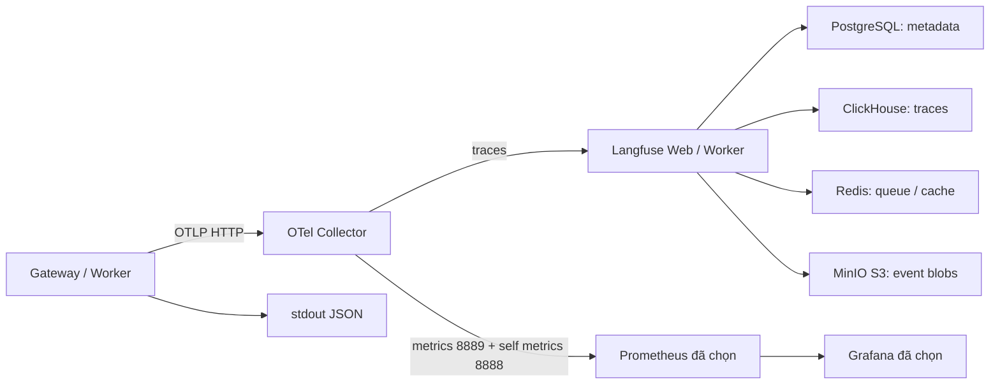

# Observability cho KiRa trên Kubernetes

Đây là các **file nguồn để review**, bổ sung cho bộ YAML app tại
[`../DEPLOY.md`](../DEPLOY.md). Langfuse được giữ để xem trace và các bước AI;
Prometheus/Grafana giữ vai trò metrics và dashboard vận hành. Mỗi signal chỉ có
một đường export và một backend được chọn. Không thêm Jaeger, Tempo, Loki,
ClickHouse Keeper, operator hay LLM server khác vào bộ này.



Chưa có thao tác apply từ laptop. Image còn là placeholder: phải thay bằng digest
đã publish tại `registry.vlp.vn`. Namespace, ServiceAccount `kira-runtime`,
Secret pull image và policy default-deny/DNS của bộ app phải tồn tại trước.
Các container chạy `linux/amd64`, đúng ba node compute `16`, `17`, `18` đã chọn,
có toleration `project=lhvtt:NoSchedule` và ưu tiên `17`/`18`.

## Chọn backend metrics để tránh triển khai trùng

- `standalone`: apply `metrics.yaml` để có Prometheus/Grafana riêng cho KiRa.
  Chỉ dùng khi chưa kết nối được monitoring chung.
- `shared`: giữ Langfuse và Collector, không apply `metrics.yaml`. Monitoring
  chung scrape Collector và nhận dashboard/rules từ repository. Phải xác minh
  Prometheus/Grafana, quyền truy cập và scrape selector trước khi coi metrics đã
  được lưu. `cattle-monitoring-system`/`cattle-dashboards` trong inventory là ứng
  viên đã nhìn thấy, chưa phải kết quả kiểm tra sức khỏe/kết nối.

Không chạy đồng thời hai backend cùng evaluate bộ alert này. `ServiceMonitor`
chưa được tạo vì chưa xác nhận CRD/selector của monitoring chung. Khi cấu hình
monitoring chung, scrape hai endpoint:

```text
otel-collector.kira-context-memory.svc:8889/metrics   # metrics ứng dụng
otel-collector.kira-context-memory.svc:8888/metrics   # metrics Collector
```

Dùng `honor_labels: true` và chỉ scrape Collector. Gateway/Worker đã bỏ `/metrics`
và registry cũ. Collector chuyển resource
attributes thành label; app phải gửi `service.instance.id`/Pod UID để phân biệt
counter và histogram giữa replica. Queue depth là queue PostgreSQL chung: giữ
`max`, không cộng bằng `sum`. Dashboard/rules chuẩn nằm trong `metrics.yaml` và
[`../../observability/`](../../observability/).

## Các file và thứ tự triển khai

| File | Nội dung |
|---|---|
| `config.yaml` | Config Langfuse, bootstrap role DB và một Collector OTLP/HTTP |
| `networkpolicy.yaml` | Các đường mạng bổ sung, theo component/namespace |
| `datastores.yaml` | PostgreSQL, ClickHouse, Redis, MinIO riêng cho Langfuse và PVC |
| `s3-init.yaml` | Job tạo/kiểm tra bucket `langfuse` bằng `mc` trong image MinIO |
| `langfuse.yaml` | Langfuse Web và Worker v3.225.7, hai replica và một PDB mỗi service |
| `collector.yaml` | Một Collector: traces → Langfuse; metrics → endpoint Prometheus |
| `metrics.yaml` | Prometheus/Grafana có PVC, dashboard/rules; chỉ cho `standalone` |

Helper triển khai đi theo thứ tự Config/policy → data store Ready → S3 Job Complete
→ Langfuse Ready → Collector Ready → metrics nếu standalone. Chỉ sau đó mới bật
OTel và restart Gateway/Worker. Script không đưa telemetry vào readiness của app;
chat và memory tiếp tục hoạt động khi telemetry không khả dụng.

Từ thư mục bundle đã render, dùng helper của bộ triển khai:

```sh
sh observability/apply.sh validate /path/to/private/kira-observability.yaml standalone
sh observability/apply.sh apply /path/to/private/kira-observability.yaml standalone
sh observability/apply.sh status
```

Khi đã xác minh monitoring chung, thay `standalone` bằng `shared` và cấu hình
scrape/rules/dashboard ở backend đó. Không apply cả thư mục bằng một lệnh vì Job
S3 và startup Langfuse cần đúng thứ tự. Chuyển sang shared không tự xóa PVC hay
workload standalone đã có; trước khi dừng instance cũ, hoàn tất chuyển scrape,
dashboard và quyền truy cập.
Sau mỗi lần apply lại core, chạy tiếp helper này: core ConfigMap đặt
`OTEL_ENABLED=false` ở bootstrap, nên chỉ apply core sẽ tắt export.

## Secret và database

Mọi credential tham chiếu Secret **`kira-observability`**. Bộ app chỉ biết địa chỉ
Collector, không nhận API key/DSN của Langfuse. Collector chỉ nhận
`LANGFUSE_OTEL_AUTH`; mỗi data store chỉ nhận credential của chính nó.

PostgreSQL Langfuse riêng với database `langfuse`. Bootstrap dùng
`LF_PG_ADMIN_PASSWORD`; role `langfuse` dùng `LF_PG_PASSWORD`, không superuser,
không được tạo database/role. Role đó sở hữu database/schema để Langfuse chạy
Prisma migrations. `LF_DATABASE_URL` phải trỏ role này đến
`langfuse-postgres:5432/langfuse?connection_limit=15&pool_timeout=10`, tách khỏi
DB app và memory. PostgreSQL cho tối đa 200 connections; bốn Pod dùng tối đa
60, khi Web/Worker cùng surge dùng tối đa 90. Nếu Secret đã tạo từ bản cũ,
bổ sung hai URL parameters và giữ nguyên password/salt/keys hiện có.

Secret còn có ClickHouse/Redis/S3 password, salt/encryption key/NextAuth secret,
email/password admin Langfuse, project public/secret key và password admin Grafana.
Redis password do helper tạo là chuỗi URL-safe; không đưa secret chứa newline hay
directive Redis vào file cấu hình. Giữ Secret và PVC qua các lần upgrade; thay
Secret bootstrap không tự đổi password trong database/PVC đã khởi tạo.

Redis dùng AOF, `noeviction`, giới hạn data `4gb` trong container limit `8Gi`.
Job S3 idempotent, không in credential; bucket được tạo qua API S3, không tạo thư
mục giả lập bucket. Không xóa/tạo lại Job đã Complete khi không cần; nếu đổi image
hoặc template Job, review việc chạy lại rồi xóa đúng Job trước khi apply bản mới.

## Tài nguyên ban đầu và giới hạn triển khai

Các con số sau đã tăng theo allocation/usage người dùng cung cấp ngày 2026-10-09.
Xem [`../CAPACITY.md`](../CAPACITY.md) để review CPU, RAM, rollout và connection
budget của cả stack. Đây chưa phải kết quả đo tải. Longhorn node `.17` còn
148,6 GiB theo snapshot, nên giữ kích thước PVC hiện tại và kiểm tra disk policy
cùng replica thực tế khi triển khai.

| Service | Replica | RAM request / limit | PVC |
|---|---:|---|---:|
| Langfuse PostgreSQL | 1 | 8Gi / 16Gi | 10Gi |
| ClickHouse | 1 | 32Gi / 64Gi | 20Gi |
| Redis | 1 | 4Gi / 8Gi | 2Gi |
| MinIO | 1 | 4Gi / 16Gi | 20Gi |
| Langfuse Web | 2 | 4Gi / 8Gi | — |
| Langfuse Worker | 2 | 8Gi / 16Gi | — |
| Collector | 1 | 4Gi / 8Gi | — |
| Prometheus, standalone | 1 | 8Gi / 24Gi | 10Gi |
| Grafana, standalone | 1 | 1Gi / 4Gi | 1Gi |

Longhorn `longhorn-storage-2-retain`, RWO, một primary cho mỗi store: đây là
**pilot không HA**. Replica volume Longhorn không cung cấp HA ở tầng PostgreSQL,
ClickHouse hay Redis. Stores Langfuse cộng 52Gi PVC; standalone metrics thêm 11Gi.
Phải kiểm tra dung lượng thực và chi phí replica Longhorn trước apply.

Web/Worker ưu tiên trải đều qua topology spread và anti-affinity; mỗi service
có PDB giữ một Pod khi drain tự nguyện. Collector vẫn một replica, strategy
`Recreate` để cumulative metrics không có hai writer trong lúc rollout.
Collector có memory limiter hard 6144 MiB, spike 1024 MiB, Go limit 4915 MiB và
trace queue 256 requests; Langfuse Web/Worker có heap limit 4096/8192 MiB.

Prometheus giới hạn lưu 30 ngày **hoặc** 8GB, điều kiện nào đến trước; PVC 10Gi
chừa phần trống nhưng vẫn cần theo dõi dung lượng. ClickHouse internal logs có
emptyDir 512Mi, nên không coi đó là log archive. Collector có queue RAM bounded,
không WAL/PVC; hết queue/restart có thể mất telemetry. Retention trace/S3,
backup/restore và capacity alert cần nghiệm thu riêng; YAML không tự chứng minh
retention 14 ngày chỉ bằng một ConfigMap.

Numeric UID/GID đã đọc trực tiếp từ image local: Langfuse `1001:65533`,
PostgreSQL/Redis `999:999`, ClickHouse `101:101`, MinIO `65532:65532`, Collector
`10001:10001`, Prometheus `65534:65534`, Grafana `472:0`. Pod chạy non-root,
drop capabilities, không mount Kubernetes API token. Root filesystem còn writable
để giữ contract image đã kiểm tra; quyền PVC thực tế qua fsGroup/Longhorn vẫn cần
kiểm tra trên cluster.

## Truy cập UI và nghiệm thu

Langfuse `http://langfuse-web:3000`, Grafana `http://grafana:3000`: hiện chỉ
ClusterIP nội bộ, Grafana bắt buộc login, signup/anonymous đều tắt. Đây là URL
working trong cluster; phải đổi `NEXTAUTH_URL`/`GF_SERVER_ROOT_URL` sang origin
thực khi mở đường browser, cùng policy ingress/TLS phù hợp. Media S3 đang dùng
địa chỉ nội bộ; browser upload/download media cần endpoint riêng được mở sau.
Không expose DB, Worker, OTLP hay MinIO console ra VDI bằng mặc định.

Policy metrics cho phép namespace `cattle-monitoring-system` scrape `8888`/`8889`.
Nó không cấp API token hay tự cấu hình Prometheus; network policy của phía
monitoring chung cũng phải cho egress tương ứng. Tất cả Pod còn dùng DNS policy
của bộ app. Không cấp internet egress, SMTP, webhook/evaluator/LLM endpoint mới.

Trước nghiệm thu: kiểm tra Ready, S3 Job Complete, login Langfuse/Grafana, trace
chat → Worker với bốn identifier, metrics thực và alert/dashboard. Dừng hoặc chặn
Collector để chứng minh app vẫn phục vụ. Không dùng local smoke/HTTP 200 làm bằng
chứng Qwen/KiRa thật hay Kubernetes đã nhận và lưu telemetry. Giữ
`OTEL_CAPTURE_CONTENT_ENABLED=false` cho đến khi review chính sách masked content.

Phép thử laptop ngày 2026-10-09 đã chạy data stores, migrations, Web/Worker và
Collector với cấu hình YAML, UID/capabilities tương ứng và credentials giả.
Trace thử được đọc lại trong Langfuse; hai stream metric của replica được giữ
tách biệt. Receipt trong checkout:
[`docs/evidence/observability-generous-yaml-local-verification-2026-10-09.json`](../../../docs/evidence/observability-generous-yaml-local-verification-2026-10-09.json).
Prometheus/Grafana cũng chạy non-root, scrape thực từ Collector, nạp bốn rules,
provision dashboard/datasource và kiểm tra bắt buộc login trong phép thử riêng.
Schema/Collector config và Prometheus rules đã kiểm tra riêng. Longhorn,
NetworkPolicy thực, provider thật và truy cập browser từ VDI vẫn cần nghiệm thu
trên cụm.

Nguồn chức năng/phụ thuộc:
[Langfuse v3.225.7 Compose](https://github.com/langfuse/langfuse/blob/v3.225.7/docker-compose.yml),
[ClickHouse bắt buộc](https://langfuse.com/self-hosting/deployment/infrastructure/clickhouse),
[Redis/Valkey queue](https://langfuse.com/self-hosting/deployment/infrastructure/cache),
[S3 event bucket](https://langfuse.com/self-hosting/deployment/infrastructure/blobstorage),
[Kubernetes NetworkPolicy](https://kubernetes.io/docs/concepts/services-networking/network-policies/).
