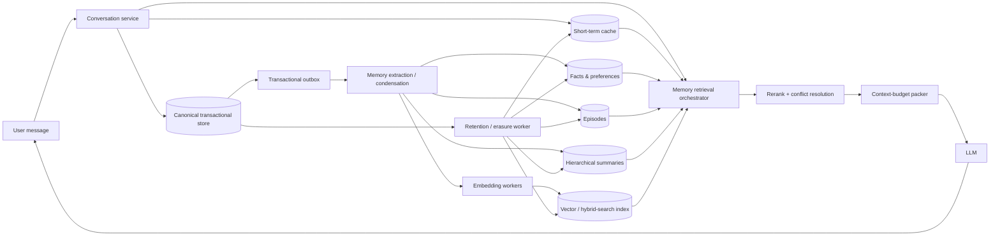
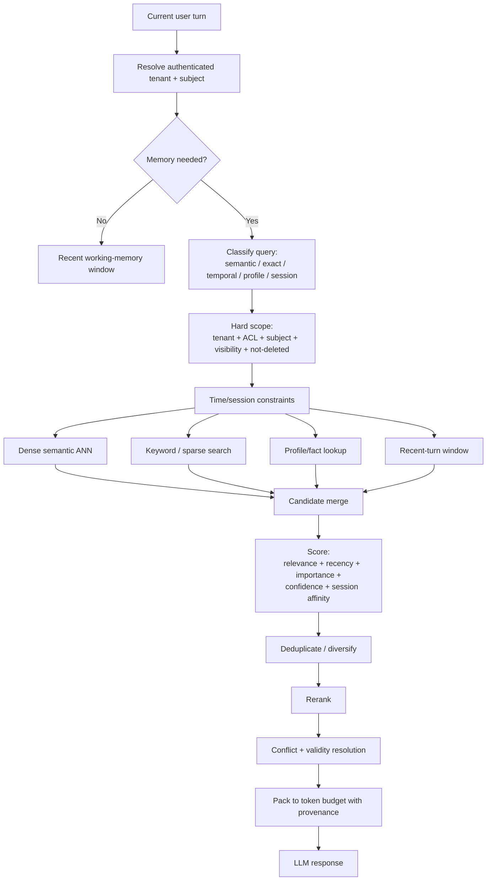
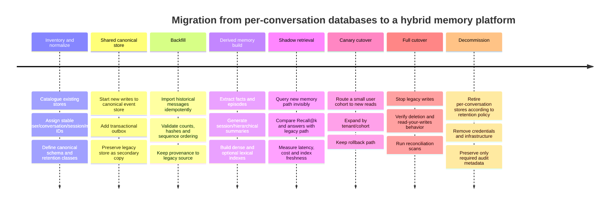
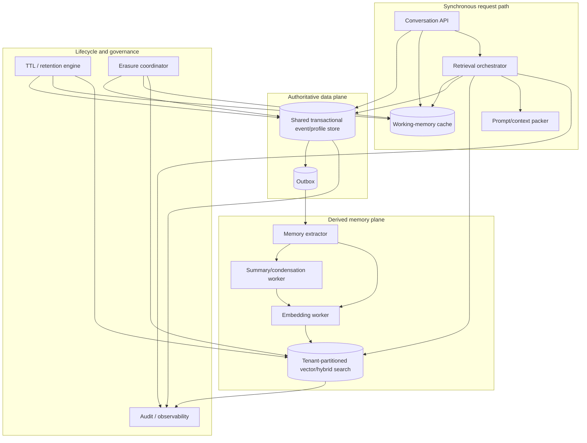

# Conversation Memory Management for Conversational AI Systems

> **Trạng thái tài liệu (2026-09-22):** đây là bản nghiên cứu tham khảo do GPT tổng hợp
> (không phải spec của dự án KiRa). Vài nhận định của nó đã được đối chiếu với code thật
> và được điều chỉnh khi áp dụng vào hệ thống hiện tại — đáng chú ý: pipeline ADD-only
> của mem0 vendored (`V3` hard-code `ADDITIVE_EXTRACTION_PROMPT`, `DEFAULT_UPDATE_MEMORY_PROMPT`
> là dead code), `linked_memory_ids` chỉ ghi trên ENTITY rows theo hướng entity→memory_ids
> (không phải memory→linked), và hybrid search gồm semantic + BM25 + entity boost (không có
> recency). Khi mâu thuẫn giữa tài liệu này và code trong repo, code là nguồn đúng.

## Executive summary

Conversation memory is not merely “chat history in a vector database.” A production memory subsystem is better modeled as a **write–manage–read lifecycle** over several kinds of state: immutable conversational events, low-latency working memory, derived episodic memories, durable user facts/preferences, summaries, and retrieval indexes. Recent systems such as MemGPT explicitly separate fast and slow memory tiers; MemoryBank adds continual updating and selective forgetting; Generative Agents separate observations from higher-level reflections; and LongMemEval shows that sustained conversational memory still fails substantially on extraction, multi-session reasoning, temporal reasoning, updates, and abstention. citeturn14view0turn14view1turn15view5turn16view0

**Primary recommendation:** for an unspecified-scale conversational AI product, use a **hybrid, multi-tier architecture**, not one physical database or vector index per conversation and not one completely undifferentiated global vector index. The recommended pattern is:

1. A **shared transactional canonical store**, partitioned by tenant/user/time, containing the authoritative append-only messages and memory metadata.
2. A **short-term working-memory cache** for active sessions.
3. A **derived long-term memory layer** containing facts, preferences, episodes, summaries, and their embeddings, logically or physically isolated by tenant.
4. A vector/search system chosen according to operational constraints: pgvector for operational simplicity and transactional proximity; Pinecone for managed serverless isolation; Weaviate for integrated multi-tenancy/search; Milvus for high-control, high-scale deployments; FAISS when an embedded search library rather than a database is appropriate. Pinecone recommends namespace-per-tenant and documents physical namespace isolation; Weaviate stores each tenant on a separate shard; Milvus exposes database-, collection-, partition-, and partition-key-level tenancy; FAISS itself is a similarity-search library and therefore leaves durability, authorization, filtering infrastructure, replication, and tenant lifecycle to the application. citeturn16view4turn17view2turn16view5turn17view5
5. A **transactional outbox or CDC pipeline** for asynchronously generating embeddings, summaries, and indexes. The transactional database remains the source of truth; vector indexes are rebuildable derived state.
6. Retrieval that combines **hard authorization scope + metadata/time/session constraints + semantic retrieval + lexical retrieval where useful + reranking + explicit recency/importance/conflict rules**. LongMemEval's experiments specifically identify session decomposition, fact-augmented indexing, and time-aware query expansion as useful long-memory optimizations. citeturn16view0



This design is preferable because it separates four concerns that otherwise become entangled: **durability**, **latency**, **semantic retrieval**, and **retention/privacy**. PostgreSQL, for example, supports row-security policies and declarative partitioning; pgvector adds exact and approximate vector retrieval while keeping vectors in PostgreSQL and therefore within the same ACID/PITR/JOIN ecosystem. citeturn13view0turn13view1turn17view6

The strongest architectural principle is:

> **Raw events should be authoritative; memories should be derived, versioned, provenance-linked, selectively retained representations of those events.**

That distinction makes summary regeneration, embedding-model migration, conflict handling, GDPR erasure, and index rebuilding dramatically safer than treating a mutable vector database as the sole record of what happened. GDPR requires data minimization, purpose limitation, accuracy, storage limitation, and security, and provides a right to erasure under specified grounds; privacy-by-design therefore strongly favors explicit lifecycle metadata and centrally orchestrated deletion rather than unmanaged copies spread across per-conversation stores. citeturn14view7turn14view8turn14view9turn14view10

**Assumptions.** Scale, latency targets, and cloud provider were not specified. Accordingly, recommendations are cloud-neutral and distinguish architectural regimes rather than assuming a particular QPS or corpus size. Any latency figures below are engineering starting targets, not universal benchmark guarantees. The report also assumes that conversations may span multiple sessions, that some memory is personalized, and that multi-tenant isolation may eventually matter even if the first implementation is single-tenant.

## Architectural models and the recommended target architecture

The phrase “one database per conversation” needs precision. A “database” might mean a physical SQL database, a schema, a collection/index, a namespace, a shard, or merely a logical `conversation_id`. Those choices have radically different control-plane and data-plane consequences. Pinecone namespaces, for example, are internal subdivisions of an index and are designed as tenant isolation units, whereas a Milvus collection is a stronger physical organizational boundary; neither is equivalent to creating thousands or millions of independently operated PostgreSQL server instances. citeturn16view4turn16view5

### Architecture comparison

| Model | Isolation | Scalability | Latency | Cost profile | Consistency | Privacy / deletion | Operational complexity | Assessment |
|---|---|---|---|---|---|---|---|---|
| **Physical DB/index per conversation** | Very strong if genuinely separate | Poor once conversation count becomes large because schemas, connections, backups, migrations and indexes proliferate | Excellent within a tiny active DB, but routing/opening many stores can dominate | High fixed/control-plane overhead; poor resource utilization | Easy inside one conversation, difficult across sessions | Conversation deletion is conceptually simple | **Very high** at large conversation counts | Good only for unusual hard-isolation requirements or local/offline files |
| **Shared database, shared indexes, `conversation_id` filter** | Logical | Excellent utilization and easiest global scaling | Usually good, but filtering/index size may become significant | Efficient sharing; weakest per-tenant cost isolation | Simplest global transactions | Centralized retention is good, but a missing scope predicate can be catastrophic | **Low–medium** | Good starting architecture, but needs strong access controls |
| **Database/index per tenant, shared conversations within tenant** | Strong tenant boundary | Scales well when tenants are far fewer than conversations | Good; search corpus naturally constrained | Reasonable; large tenant skew must be handled | Cross-session personalization is natural | Tenant offboarding becomes straightforward | **Medium** | Strong B2B/SaaS pattern |
| **Shared store + namespace/partition per tenant + conversation metadata** | Strong-to-moderate depending product | Excellent | Usually excellent because search scope is reduced before ANN | High utilization with bounded query scope | Canonical DB can be strong; vector index often eventual | Good, especially with tenant-level lifecycle operations | **Medium** | **Default recommendation** |
| **Hybrid shared-by-default + dedicated placement for exceptional tenants** | Configurable | Excellent | Configurable | Best ability to match spend to tenant size/SLA | Requires routing metadata | Best support for regulated/high-value customers | **Medium–high** | **Recommended mature architecture** |

The concern with a true database-per-conversation design is less raw data size than **cardinality of operational objects**. Every physical store potentially introduces connection state, schema migration state, health monitoring, backup/restore state, credentials/policies, index build state, and lifecycle operations. By contrast, database systems are specifically designed to hold large numbers of rows and use partition/index keys to constrain access. PostgreSQL partitioning supports partition pruning and efficient removal of old ranges; vector systems expose analogous tenant partitions or namespaces. citeturn13view1turn17view4

A completely shared vector index has the opposite failure mode. Resource utilization is excellent, but **authorization and query scoping become correctness-critical**. Metadata filters are useful—Pinecone and Weaviate both support filter expressions—but an application-level filter should not be treated as the only security boundary when cross-tenant leakage would be severe. Pinecone's namespace model explicitly places tenant data in separate serverless namespaces; Weaviate states that each tenant is stored on a separate shard and is not visible to another tenant. citeturn17view3turn13view5turn17view0turn17view2

Milvus makes the isolation/scalability continuum particularly explicit. Current documentation describes database-level tenancy as the strongest default model, collection-level isolation as physically separated with up to 65,536 collections by default, partition-level tenancy as up to 1,024 partitions per collection without partition-level RBAC, and partition-key tenancy as the highly scalable option supporting millions of tenants but with weaker isolation because multiple tenants can share a physical partition. citeturn16view5turn17view1

Pinecone similarly illustrates why logical/physical tenant partitioning can affect economics as well as security. Its current serverless documentation recommends one namespace per tenant and says query cost is based on namespace size; in Pinecone's own example, querying one 1-GB tenant namespace consumes one read unit whereas filtering one tenant out of a shared 100-GB namespace consumes 100 read units. That is a **Pinecone-specific pricing behavior, not a universal vector-database law**, but it demonstrates why query scope can materially change cost. citeturn17view0

**Recommended target topology**

| Memory tier | Contents | Authoritative? | Typical medium | Update mode | Scope |
|---|---|---:|---|---|---|
| Turn/event history | User/assistant/tool events | **Yes** | PostgreSQL / distributed SQL / durable document DB | Append first | Tenant → user → conversation/session |
| Working memory | Recent turns, active task state, current summary | No | Process cache + Redis-class cache | Synchronous | Session |
| Semantic/episodic memory | Distilled events, prior tasks, notable interaction fragments | No | Vector/hybrid index | Async | User, possibly session |
| Semantic profile | Stable facts, preferences, constraints | Derived but business-significant | SQL/document + optionally vector index | Async/versioned | User |
| Hierarchical summaries | Session/day/topic/user summaries | No | SQL/object store + embeddings | Async/periodic | Session/user |
| Search indexes | Dense/sparse representations | No | pgvector/Pinecone/Milvus/Weaviate/FAISS | Async/rebuildable | Partitioned |
| Cold archive | Raw historical payloads where retention permits | Depends policy | Object storage | Batch | Retention class |

MemGPT's virtual-context design provides an analogous conceptual separation between limited active context and larger external memory, while LongMem stores historical context outside the immediate model input and retrieves it on demand. These papers support the broader systems principle that **context-window capacity and persistent memory capacity should not be conflated**. citeturn14view0turn15view6

## Data model, chunking, embeddings, indexing, sharding, and caching

**Canonical schema.** Store the original conversational event separately from derived memory representations. A practical schema looks like this:

```text
messages
  tenant_id
  subject_user_id
  conversation_id
  session_id
  message_id              // immutable, globally unique
  sequence_no
  role                     // user / assistant / tool / system
  content_or_blob_pointer
  created_at
  retention_class
  expires_at
  deleted_at
  version

memory_items
  tenant_id
  subject_user_id
  memory_id
  memory_type              // fact, preference, episode, summary, task
  conversation_id?         // nullable for cross-session memory
  session_id?
  retrieval_text
  source_message_ids[]
  importance
  confidence
  valid_from
  valid_to
  supersedes_memory_id?
  visibility_scope
  embedding_model
  embedding_version
  embedding?
  created_at
  last_accessed_at
  expires_at
  deleted_at
  memory_version

memory_edges              // optional graph layer
  tenant_id
  source_memory_id
  target_memory_id
  relation_type
  confidence

outbox
  event_id
  aggregate_id
  action
  payload_version
  attempt_count
  created_at
  processed_at
```

The `source_message_ids`/provenance relationship is important because higher-level memories are lossy. Generative Agents explicitly synthesizes observations into higher-level reflections, RAPTOR recursively summarizes lower-level chunks, and A-MEM creates structured attributes and links that can evolve as new information arrives. Retaining provenance allows derived memories to be checked, regenerated, invalidated, or deleted when their source changes. citeturn15view5turn15view0turn15view7

For SQL access paths, a reasonable baseline is:

```text
PRIMARY KEY (tenant_id, message_id)

INDEX messages_user_time
    (tenant_id, subject_user_id, created_at DESC)

UNIQUE INDEX messages_session_sequence
    (tenant_id, conversation_id, session_id, sequence_no)

INDEX active_memory_user_type_time
    (tenant_id, subject_user_id, memory_type, valid_from DESC)
    WHERE deleted_at IS NULL
```

A shared relational store should enforce tenancy below the application layer where practical. PostgreSQL row-level security can constrain which rows roles may read or update, while partitioning can separately route data according to a partition key and prune irrelevant partitions during queries. citeturn13view0turn13view1

**Chunking should follow conversation semantics, not blindly reproduce document-RAG conventions.** Keep original turns intact in the canonical store, then derive multiple retrieval granularities:

- **Atomic semantic memories:** “User prefers aisle seats,” “Project Atlas deadline moved to Friday.”
- **Episodic units:** a coherent exchange, task, or topic spanning several turns.
- **Session summaries:** compact representation of one conversation/session.
- **Hierarchical summaries:** summaries of summaries for long user histories.

LongMemEval found that session decomposition and fact-augmented keys improve long-term memory, while RAPTOR shows that hierarchical recursive summaries can make information available at different abstraction levels. Late Chunking highlights the central chunking trade-off: short units give more focused retrieval representations, but independent encoding can discard surrounding context; its proposed technique contextualizes tokens before pooling chunks. citeturn16view0turn15view0turn16view2

A practical engineering starting point—not an empirically universal optimum—is to prefer **turn/topic boundaries over arbitrary character counts**. For episodic chunks, start with a few adjacent turns and benchmark alternative granularities on your own conversations. Avoid large overlaps unless evaluation shows a benefit because overlap inflates storage, duplicate retrieval, embedding cost, and deletion work. LongMemEval's findings are particularly relevant here because memory retrieval quality depends not only on the embedding model but also on how histories are decomposed and indexed. citeturn16view0

**Embedding strategy.** Do not necessarily embed the raw text verbatim. Maintain a `retrieval_text` optimized for lookup, for example:

```text
Type: user_preference
Subject: user_73492
Time: 2026-09-19
Fact: Prefers morning flights and aisle seats.
Context: Business travel preferences.
Entities: flight, morning, aisle seat
```

The original source remains available separately. Embedding model name/version and preprocessing version must be stored with the vector so that migrations can be dual-indexed rather than silently mixing incompatible vector spaces. The embedding choice should be evaluated on the actual workload rather than chosen solely from a generic leaderboard: MTEB spans retrieval, clustering, reranking and other tasks across many languages and found that no one embedding method dominated all tasks. This is especially relevant for Vietnamese–English code-switching: test Vietnamese, English, and mixed-language queries on your own memory corpus. citeturn16view1

Dense embeddings alone are weak at some exact identifiers, names, order numbers, dates, or unusual spellings. For production memory, a **hybrid dense + lexical/sparse retriever** is often safer: lexical retrieval captures literal tokens while semantic retrieval captures paraphrases. Weaviate exposes vector, keyword, hybrid search, filtering and reranking as first-class search functions; Pinecone records can also carry metadata used as hard query constraints. citeturn13view5turn17view3

### Vector database comparison

| Technology | What it is | Multi-tenancy / filtering | Index/search characteristics | Operational burden | Best fit | Main caveat |
|---|---|---|---|---|---|---|
| **Pinecone** | Managed vector service | Namespace-per-tenant is the documented serverless pattern; metadata filters supported; namespaces physically separated in serverless. citeturn16view4turn17view3 | Implementation mostly abstracted from operator | **Low** | Teams prioritizing managed scaling and low ops | Vendor-specific economics and less low-level index control |
| **Milvus** | Distributed vector DB | DB, collection, partition and partition-key tenancy with different isolation/scaling trade-offs. citeturn16view5turn17view1 | FLAT, IVF variants, HNSW, DiskANN and quantized options documented. citeturn16view6turn16view7 | **High** self-hosted; lower managed | Large deployments needing explicit index/storage control | More tuning and operating surfaces |
| **Weaviate** | Integrated vector/search DB | Tenant is stored on a separate shard; metadata filters, keyword/vector/hybrid search; quantization available. citeturn17view2turn13view5turn13view4 | Integrated retrieval stack; compression options include RQ/PQ/BQ/SQ | **Medium–high** self-hosted | Applications wanting integrated multi-tenant hybrid search | More infrastructure than an embedded library; feature/configuration surface is broad |
| **FAISS** | Similarity-search library, not an operational database | Application must implement tenancy, persistence and authorization | Exact Flat, HNSW, IVF, PQ/SQ and GPU implementations; very direct low-level control. citeturn17view5turn16view8 | **High** once production DB semantics are added | Embedded/offline search, custom high-performance systems, research | You own replication, failover, WAL/durability, metadata DB, ACLs and lifecycle |
| **pgvector** | PostgreSQL extension | Uses ordinary Postgres schema, predicates, partitioning and RLS; vectors live beside relational state. citeturn17view6turn13view0 | Exact by default; HNSW and IVFFlat ANN available. HNSW offers a better speed/recall trade-off than IVFFlat in its docs but costs more memory/build time. citeturn13view3 | **Low–medium** if Postgres already exists | Small-to-large operational systems where relational consistency matters | At very high vector scale/search throughput, a specialized distributed engine may be easier to scale independently |

There is no defensible universal statement that “database X is fastest.” Query latency depends on vector count, dimensions, filter selectivity, index parameters, recall target, hardware, replication topology, concurrency, and whether vectors reside in RAM or on SSD. For that reason, a product selection should run an application-specific benchmark at fixed `Recall@k`, not compare vendor latency claims measured under different conditions. FAISS itself describes index selection as a trade-off among search time, quality, memory, training and insertion cost, and Milvus likewise emphasizes memory/performance/index-structure trade-offs. citeturn17view5turn16view6

### Indexing-method comparison

Let \(N\) be vector count, \(d\) embedding dimensionality, `nlist` the number of IVF cells, and `nprobe` the number searched.

| Index | Query characteristics | Memory | Build/update | Recall | When to use |
|---|---|---|---|---|---|
| **Flat exact** | \(O(Nd)\) distance computation | Raw FP32 ≈ \(4d\) bytes/vector | Minimal | Exact | Small tenant corpus, highly selective prefilter, benchmark ground truth |
| **HNSW** | Typically sublinear graph traversal; commonly described as roughly logarithmic navigation, but production worst-case behavior depends on graph/data/parameters | High: raw vectors plus graph edges | Expensive relative to Flat; online insertion possible | High, tunable | Low-latency/high-recall in-memory retrieval |
| **IVF-Flat** | Roughly proportional to vectors in probed cells: approximately \(O(\text{nprobe}·N/\text{nlist}·d)\), plus centroid selection | Near raw vectors + IDs/centroids | Requires clustering/training | Tunable | Large datasets and throughput-oriented search |
| **IVF-PQ / PQ** | Reduced memory bandwidth/distance cost | Much lower | Training/encoding required | Lower unless refined | Memory-constrained very-large corpora |
| **SQ8** | Similar search family with scalar-compressed vectors | Roughly one byte/dimension for vector payload | Compression step | Some information loss | Moderate compression with relatively straightforward operation |
| **DiskANN-class** | SSD-oriented ANN | Lower RAM pressure | More storage/I/O tuning | Tunable | Corpus too large for economical full in-memory graph |

FAISS documents Flat as `4*d` bytes per vector, IVFFlat as approximately `4*d + 8`, SQ8 as roughly `d`, and PQ as `ceil(M * nbits / 8)` bytes for the compressed code. Milvus documents SQ8 as reducing vector storage by about 75% relative to FP32 and product quantization as providing much stronger compression with a recall trade-off. citeturn16view8turn16view6

For example, a 1,536-dimensional FP32 embedding is:

\[
1{,}536 \times 4 = 6{,}144\text{ bytes}
\]

before graph edges, IDs, metadata, replicas, allocator overhead, or index structures. Ten million such raw embeddings alone therefore require about 61.4 GB in decimal units. Quantization can reduce the vector component substantially, but compression should be benchmarked against memory-retrieval quality because Weaviate and Milvus both explicitly note that quantization is lossy. citeturn13view4turn16view6

**Sharding and partitioning.** A good key hierarchy is:

```text
region
  -> tenant_bucket or dedicated_tenant
      -> subject_user_id hash
          -> optional time partition
```

Do not shard primarily on `conversation_id` if the product requires cross-session user memory: doing so makes one user's historical retrieval a fan-out query over every conversation shard. A user/tenant-oriented partition key keeps the dominant personalization query local. For extremely large tenants, introduce a second-stage hash or temporal partition. Milvus's partition-key implementation follows the same broad principle: it hashes a scalar key to physical partitions and restricts queries to matching partitions when the key is supplied. citeturn17view4

Time partitioning is particularly useful for raw event retention because old partitions can be retired efficiently. PostgreSQL documentation notes that dropping/detaching old partitions avoids physically moving individual old rows, which is useful for high-volume retention workflows. citeturn13view1

**Caching.** Use at least two scopes:

```text
L1: process-local
    - current session state
    - most recent model-ready context
    - extremely short lifetime

L2: shared cache, e.g. Redis-class system
    - recent turns
    - current session summary
    - hot user profile
    - selected retrieval results
```

Cache keys must contain the full security scope, for example:

```text
memory:v3:{tenant_id}:{subject_user_id}:{session_id}:{memory_version}:{query_hash}
```

A cache entry retrieved under one tenant/user must never be reusable under another merely because the semantic query text is the same. Cache invalidation should be triggered by memory mutation, deletion, profile change, or memory-version increments. Redis supports LRU, LFU and TTL-aware eviction policies, among others; these are cache-capacity mechanisms, not substitutes for durable retention policy. citeturn13view2

## Retrieval, pruning, summarization, condensation, and TTL

Memory retrieval should not be a single `vector_search(query, k=5)` call. Long-term conversational questions may be semantic (“what kind of restaurants do I like?”), temporal (“what did I decide last Tuesday?”), exact (“what was the confirmation number?”), session-local (“as I said five minutes ago”), or update-sensitive (“I no longer live in Hanoi”). LongMemEval isolates exactly these kinds of capabilities—including temporal reasoning and knowledge updates—and reports approximately a 30% accuracy drop for evaluated commercial assistants and long-context LLMs across sustained interactions. citeturn16view0

A stronger retrieval pipeline is:



**Hard security scope must occur before or as part of candidate retrieval**, not after untrusted records have entered the context. Metadata filtering is supported in Pinecone and Weaviate, while physical/logical tenant partitions provide an additional boundary. For higher-risk data, use both infrastructure-level tenant isolation and query-level metadata constraints rather than betting isolation entirely on a correctly constructed prompt or one metadata field. citeturn17view3turn13view5turn17view0turn17view2

A practical scoring model is:

\[
score(m,q) =
w_s S_{semantic}
+w_l S_{lexical}
+w_r f_{recency}
+w_i importance
+w_c confidence
+w_{sess} sessionAffinity
-w_{stale} stalenessPenalty
\]

The weights should be tuned against downstream answer quality, not just nearest-neighbor relevance. LongMemEval is useful because it evaluates the eventual ability to answer from long histories rather than merely whether the “right-looking” chunk appeared at rank one. citeturn16view0

**Time-windowing should be adaptive.** A useful policy is recent-first for ordinary conversational continuation, but explicit temporal questions should expand or shift the search range according to interpreted dates. LongMemEval specifically proposes time-aware query expansion. A current-session boost should normally be a soft score rather than an absolute filter; otherwise a new conversation cannot recall a durable preference from an earlier session. citeturn16view0

**Context composition should guarantee recent state independently of vector similarity.** For example:

```text
context budget
  25%: current/recent turns
  10%: current session summary
  15%: stable profile/preferences
  35%: retrieved episodic/factual evidence
  15%: reserved for instructions/tools/headroom
```

Those percentages are illustrative engineering defaults, not research-established constants. The key principle is structural: do not allow ANN retrieval to eject the immediate conversation state simply because an older passage has a marginally higher cosine score. MemGPT's tiered-memory architecture and Generative Agents' separation of observations, reflections and planning illustrate the value of distinct memory roles rather than one undifferentiated history. citeturn14view0turn15view5

### Pruning and condensation strategies

| Strategy | Decision rule | Runtime/storage advantage | Failure mode | Recommended role |
|---|---|---|---|---|
| **Sliding window / LRU** | Discard least-recently-used/oldest state | Extremely simple; bounded active context | Old but important fact disappears | Working-memory cache only |
| **TTL** | Delete after explicit expiration | Predictable storage/retention | Important state disappears if TTL classification is wrong | Cache + policy-driven classes |
| **Importance + recency decay** | Keep high-importance/reinforced memories longer | Better than raw age | Scoring can encode bias or become unstable | Episodic memory |
| **Semantic deduplication** | Merge/skip near-duplicate facts | Cuts redundant vectors/tokens | Similar-but-different statements may be incorrectly collapsed | Repeated preferences/status |
| **Supersession/versioning** | New fact invalidates older state without destroying provenance immediately | Correct handling of updates | Needs temporal reasoning | Profile/preferences |
| **Rolling summary** | Condense older turns into session summary | Large context reduction | Information loss and summary drift | Medium-term session memory |
| **Hierarchical summaries** | Recursively cluster/summarize lower levels | Multi-scale retrieval; strong compression | More compute; errors can propagate upward | Long histories |
| **Semantic pruning** | Delete/condense low-value or redundant items using semantic/importance score | Higher information density | Harder to audit than TTL | Cost optimization after evaluation |

MemoryBank provides a concrete research example of combining elapsed time and memory importance for selective forgetting/reinforcement. RAPTOR provides the complementary hierarchical approach: recursively embedding, clustering and summarizing information into a retrieval tree; its paper reports substantial gains on its tested QA benchmarks, including a 20-point absolute QuALITY gain in one GPT-4 configuration. These results do not prove that the same numbers apply to conversation memory, but they provide strong evidence for multi-resolution retrieval when queries may target either details or high-level themes. citeturn14view1turn15view0

**Memory condensation** should transform many noisy interaction records into fewer evidence-bearing records, but should not simply overwrite history:

```text
Raw:
  U: I usually take the 7am flight because I hate arriving late.
  ...
  U: Actually, for the Tokyo trip book me an afternoon flight.

Derived:
  Preference:
    "Generally prefers morning flights."
    confidence = 0.82
    scope = general

  Exception/task constraint:
    "For Tokyo trip, prefers afternoon flight."
    confidence = 0.99
    scope = trip_932
    valid_until = end_of_trip
```

That distinction between global preference and scoped exception is crucial. A naive “latest statement wins globally” algorithm would destroy a legitimate stable preference. Conversely, storing both with no validity/scope model may produce contradictory prompts. A-MEM's dynamic structured-memory model similarly argues for richer contextual attributes and evolving relationships rather than treating every memory as an isolated text fragment. citeturn15view7

A useful condensation job is:

```text
for each user/session segment:
    candidates = uncondensed_memory_items(segment)

    clusters = semantic_cluster(candidates)

    for cluster in clusters:
        summary = summarize_with_evidence(cluster)
        facts = extract_atomic_facts(cluster)

        transaction:
            insert summary(version, source_ids, validity)
            upsert facts(with provenance)
            mark sources as condensed_to(summary_id)

        enqueue embeddings(summary, facts)
```

**TTL must be semantic and purpose-based, not global.** A suggested policy matrix is:

| Data class | Example lifecycle | Rationale |
|---|---|---|
| L1 working state | Seconds/minutes after inactivity | Pure performance state |
| L2 session cache | Minutes/hours | Avoid stale/session leakage |
| Tool scratchpad/intermediate results | Very short unless product requires history | Usually low enduring value |
| Session summaries | Retain while their source/history purpose remains valid | Medium-term continuity |
| Raw transcript | Product/legal retention policy | Contains highest-detail PII |
| Durable preference | Until changed, erased, or no longer required for stated purpose | Personalization |
| Temporary preference | Explicit `valid_to` | Prevent stale behavior |
| Embeddings/index replicas | No longer than corresponding source/derived memory | Derived data should not outlive authorized source purpose |

The exact day counts should be chosen from product purpose, legal basis, user expectations, contractual requirements, and applicable law—not copied from a generic architecture. GDPR's Article 5 requires personal data to be limited to what is necessary and identifiable data not to be retained longer than necessary for its purpose; Article 25 extends those principles into protection by design/default. citeturn14view7turn14view9

A cache TTL is **not** GDPR erasure. When an erasure request is valid, active copies and derived representations need coordinated deletion. Article 17 creates an erasure right in specified circumstances, while GDPR's accuracy and storage-limitation principles also make stale or unnecessary personalized memory a governance issue. citeturn14view8turn14view7

A deletion pipeline should therefore look like:

```text
1. authorize erasure request
2. write canonical deletion/tombstone event
3. immediately exclude record from reads
4. delete/cryptoshred canonical active payload as policy requires
5. delete derived facts/summaries
6. delete vector/sparse indexes
7. invalidate L1/L2 caches
8. notify downstream replicas/processors where applicable
9. record completion/audit metadata without retaining erased content
10. ensure restore procedures do not resurrect deleted data
```

## Long-term memory, personalization, consistency, multi-user conflicts, and GDPR

A useful memory taxonomy is **working, episodic, semantic, and procedural/task state**.

| Memory type | Examples | Scope | Write frequency | Retrieval style |
|---|---|---|---:|---|
| Working/short-term | Current topic, unfinished form, last tool result | Session | Every turn | Direct/recent |
| Episodic | “Discussed relocation plans in June” | User/session | Selective | Semantic + time |
| Semantic profile | Name, stable preference, accessibility need | User | Rare/selective | Key/value + semantic |
| Task/project | Deadlines, choices, constraints | User/team/project | Moderate | Metadata + semantic |
| Reflection/summary | “The user generally prioritizes cost over speed” | User | Periodic | Semantic |
| Shared/group memory | Team decision or shared project fact | Group | Selective | ACL + subject/project |

Research systems reinforce this separation. Generative Agents stores experiences and produces higher-level reflections; MemoryBank continually updates long-term memory and user representations; Mem0 extracts, consolidates and retrieves salient conversational information, with an additional graph-memory variant. citeturn15view5turn14view1turn15view1

**Do not infer durable personalization from every utterance.** An extraction decision should ask:

```text
Is the statement:
  - likely useful in a future session?
  - attributable to the user rather than the assistant?
  - sufficiently explicit/confident?
  - permitted for this purpose?
  - sensitive enough that persistence should be prohibited or specially handled?
  - scoped globally, to a project, or only to the current task?
  - already represented by an equivalent memory?
```

The rationale follows both engineering and privacy principles: persistent memory that is not useful increases retrieval noise, while GDPR requires data minimization and purpose limitation. citeturn14view7

**Conflicting memories should be temporal objects, not mutable singleton strings.** Use:

```text
memory_id
fact_key = "home_city"
value = "Da Nang"
valid_from = 2024-04-02
valid_to = 2026-08-11

memory_id
fact_key = "home_city"
value = "Ho Chi Minh City"
valid_from = 2026-08-11
valid_to = NULL
supersedes = previous_memory_id
```

This preserves the ability to answer both “Where do I live now?” and “Where was I living in 2025?”—precisely the distinction that disappears when a profile row is blindly overwritten. LongMemEval includes both temporal reasoning and knowledge updates as separate memory competencies. citeturn16view0

For concurrent sessions, use optimistic versioning:

```text
read profile_version = 41
extract proposed memory update

transaction:
    if current_profile_version != 41:
        reload conflicting facts
        reconcile again

    append memory_event
    insert/supersede memory_item
    increment profile_version
    insert outbox_event

commit
```

The vector index should not participate in this distributed transaction. Commit canonical state and an outbox record together, then asynchronously project that state to search infrastructure. That produces a controlled form of **eventual consistency** while avoiding a fragile cross-database two-phase transaction.

To provide **read-your-writes** behavior despite an async vector pipeline:

```text
retrieval candidates =
    current session cache
    UNION canonical recent events since vector_watermark
    UNION vector-search results
```

Thus the user's latest statement is available immediately even when embedding workers are seconds behind.

For summaries, store:

```text
summary_version
source_start_sequence
source_end_sequence
source_hash
generated_at
model_version
```

Any source mutation, deletion, or correction can then invalidate a summary instead of silently leaving a contradictory derived representation.

**Multi-user/group conversations require separating the person a memory is about from the people allowed to access it.** A robust record therefore needs fields such as:

```text
subject_ids       // whom the memory describes
owner_tenant_id
visibility_scope  // private / conversation / team / org
acl_principals
source_session
```

A statement made by Alice about Alice in a group channel should not automatically become Bob's private long-term profile, nor should Alice's private profile automatically be injected into a group context. This is primarily an authorization/data-modeling problem, not an embedding problem.

**Privacy posture.** Operationally, treat embeddings, extracted profile facts, summaries, retrieval caches and graph edges as personal data whenever they remain linkable to an identifiable person or are derived from their personal conversational data. Even where the precise legal classification depends on circumstances, treating derived artifacts as in-scope is the safer architecture because otherwise deletion from the raw transcript can leave semantically equivalent information behind in vector/search systems.

GDPR creates several direct architectural requirements:

| GDPR principle / requirement | Memory-system consequence |
|---|---|
| Purpose limitation | Record why a memory class exists; do not reuse chat memory indiscriminately |
| Data minimization | Persist only memories likely to serve the declared purpose |
| Accuracy | Support correction, supersession, confidence and provenance |
| Storage limitation | Explicit `expires_at` / retention class; purge derived indexes too |
| Integrity/confidentiality | Encrypt and enforce access controls |
| Privacy by design/default | Private scope and minimal persistence should be defaults |
| Erasure | Maintain a deletion graph from source → summaries → embeddings → caches |
| Security appropriate to risk | Encryption, pseudonymization, resilience and regular control testing |

These requirements come directly from GDPR Articles 5, 17, 25 and 32. Article 32 specifically names measures including pseudonymization/encryption, confidentiality/integrity/availability/resilience, recovery capability and regular testing of safeguards. citeturn14view7turn14view8turn14view9turn14view10

For sensitive deployments, combine:

```text
tenant-aware authorization
+ DB row-level security / vector tenant isolation
+ encryption in transit
+ encryption at rest
+ optional per-tenant envelope-encryption keys
+ pseudonymous internal subject IDs
+ minimal logs
+ audited administrative access
+ deletion/tombstone propagation
+ geographic placement controls where required
```

PostgreSQL row security provides a database-level mechanism for restricting rows, while vector systems such as Pinecone, Weaviate and Milvus expose different physical/logical tenant boundaries. citeturn13view0turn17view0turn17view2turn16view5

## Implementation patterns, complexity, performance, and observability

### Ingestion flow

The online path should prioritize durability and user-visible response time. Expensive extraction, summarization and embedding can normally run asynchronously:

```text
function ingest_turn(auth, conversation_id, session_id, message):
    tenant = authorize(auth, conversation_id)

    transaction:
        seq = next_sequence(conversation_id, session_id)

        insert messages(
            tenant_id        = tenant.id,
            conversation_id  = conversation_id,
            session_id       = session_id,
            message_id       = message.id,
            sequence_no      = seq,
            content          = encrypt_or_reference(message.content),
            created_at       = now()
        )

        insert outbox(
            event_id     = deterministic_id(message.id, "memory-extract"),
            aggregate_id = message.id,
            action       = "MEMORY_EXTRACT"
        )

    working_cache.append(
        tenant, conversation_id, session_id, message
    )

    return committed
```

The idempotency key should derive from the immutable source message and processing version, so retries do not create duplicate memories.

The asynchronous projector:

```text
function process_memory_event(event):
    msg = canonical_store.get(event.aggregate_id)

    if msg.deleted:
        return

    extracted = memory_extractor(
        recent_context(msg),
        existing_profile(msg.subject_user_id)
    )

    for candidate in extracted:
        if not should_persist(candidate):
            continue

        existing = find_related_active_memories(candidate)

        resolution = reconcile(candidate, existing)

        transaction:
            write_versioned_memory(resolution)
            write_outbox("EMBED_MEMORY", resolution.memory_id)

        update_cache_versions(resolution.subject_user_id)
```

Then:

```text
function embed_memory(memory_id):
    m = load_active_memory(memory_id)

    vector = embed(
        text = m.retrieval_text,
        model = CURRENT_EMBEDDING_MODEL
    )

    vector_store.upsert(
        namespace = tenant_namespace(m.tenant_id),
        id = m.memory_id,
        vector = vector,
        metadata = {
            subject_user_id,
            conversation_id,
            session_id,
            memory_type,
            valid_from,
            valid_to,
            visibility_scope,
            memory_version
        }
    )

    advance_index_watermark(m.subject_user_id)
```

Pinecone and Weaviate both support metadata-constrained retrieval, while pgvector can keep the vector representation directly beside relational metadata. citeturn17view3turn13view5turn17view6

### Retrieval flow pseudocode

```text
function retrieve_memory(auth, query, conversation, token_budget):
    scope = authorize_and_resolve_scope(auth, conversation)

    recent = working_cache.get_recent(scope.session_id)

    intent = classify_memory_query(query)
    time_filter = extract_time_constraint(query, intent)

    filters = {
        tenant_id: scope.tenant_id,
        subject_user_id: scope.subject_user_id,
        visible_to: auth.principal,
        deleted: false,
        valid_at: query_reference_time(query)
    }

    if time_filter:
        filters &= time_filter

    dense_candidates = vector_search(
        embedding = embed_query(query),
        filters = filters,
        top_k = ANN_CANDIDATE_K
    )

    lexical_candidates = lexical_search(
        query = query,
        filters = filters,
        top_k = LEXICAL_CANDIDATE_K
    )

    not_yet_indexed = canonical_store.read_since(
        subject = scope.subject_user_id,
        watermark = vector_index_watermark(scope.subject_user_id)
    )

    candidates = merge(
        recent,
        dense_candidates,
        lexical_candidates,
        not_yet_indexed
    )

    candidates = score_recency_importance_confidence(candidates)
    candidates = deduplicate_and_diversify(candidates)
    candidates = rerank(query, candidates)
    candidates = resolve_superseded_and_conflicting(candidates)

    return pack_by_token_budget(
        current_session = recent,
        profile = relevant_profile_facts(candidates),
        evidence = candidates,
        preserve_provenance = true,
        max_tokens = token_budget
    )
```

### Update and deletion flow

```text
function update_memory(subject, new_fact, source_message):
    related = find_by_fact_key_or_semantic_match(subject, new_fact)

    transaction:
        for old in related:
            if contradicted_by(new_fact, old):
                old.valid_to = new_fact.valid_from
                old.status = "superseded"

        new = insert_memory(
            fact = new_fact,
            supersedes = ids_of_contradicted_items,
            source = source_message
        )

        insert_outbox("REINDEX", new.id)
        insert_outbox("DELETE_OR_UPDATE_OLD_VECTORS", related.ids)

    invalidate_user_cache(subject)
```

A critical operational detail is **delete-first visibility**: once canonical state marks memory deleted, retrieval should suppress it immediately even if physical index deletion is still pending.

### Expected complexity

| Operation | Approximate complexity | Important practical qualification |
|---|---:|---|
| Append message to indexed relational log | \(O(\log N)\) index maintenance, implementation-dependent | Usually negligible versus model inference |
| Read latest `k` turns through `(session, sequence)` index | \(O(\log N + k)\) | Highly cacheable |
| Scan full history | \(O(N)\) records / \(O(T)\) tokens | Prompt/model cost grows with history |
| Flat vector KNN | \(O(Nd)\) | Exact recall; useful baseline |
| HNSW ANN | Empirically/sublinearly navigated; often modeled near \(O(\log N)\) search | No simple universal latency bound; depends strongly on `M`, `ef`, data geometry |
| IVF ANN | Approx. \(O(nprobe·N/nlist·d)\) candidate distance work | Centroid search and filtering add cost |
| Hash-map cache lookup | Expected \(O(1)\) | Network RTT often exceeds CPU cost |
| LRU cache eviction | Expected constant-time with standard map/list structure | Redis uses implementation-specific approximations/algorithms |
| Semantic dedupe against global corpus | Naively \(O(Nd)\); ANN reduces candidate discovery | Always verify near-neighbor merges |
| Summary generation | Model-dependent, roughly proportional to input/output tokens | Usually much more expensive than DB operations |

FAISS provides the exact Flat storage formula and multiple ANN index families, while Milvus describes IVF bucket search and HNSW graph navigation; pgvector exposes the HNSW parameters `m`, `ef_construction` and `ef_search`, with higher search/build settings trading speed for recall. citeturn16view8turn16view6turn13view3

**A reasonable initial interactive SLO**, pending real measurement, is to keep the memory subsystem materially below LLM generation latency—for example, a p95 of roughly 100–150 ms for the entire cache/search/rerank stage in a same-region deployment. A possible *budget*, not a benchmark, is:

| Component | Initial engineering target |
|---|---:|
| Authorization + routing | < 10 ms p95 |
| Hot cache | < 5 ms p95 same-region |
| Vector/hybrid candidate retrieval | < 50 ms p95 |
| Reranking | < 75–100 ms p95 |
| Context assembly | < 20 ms p95 |
| Async indexing lag | < several seconds for ordinary writes; much tighter for deletion visibility |

The exact numbers should be replaced with observed workload percentiles.

Published system-level numbers illustrate the potential—but should not be treated as vendor-independent predictions. Mem0 reports, on its LOCOMO evaluation setup, a 26% relative improvement in its LLM-as-judge metric versus the paper's OpenAI baseline, about 2% additional overall score for its graph variant, 91% lower p95 latency and over 90% lower token cost than the paper's full-context method. These are **paper-reported results for a particular methodology and workload**, not a general production SLA. citeturn16view3

LongMemEval supplies an arguably more useful deployment lesson: even large-context systems can lose substantial accuracy over sustained interaction, and the authors found indexing and retrieval design changes—session decomposition, fact-enhanced keys and time-aware query expansion—to matter materially. Thus, “the model has a large context window” is not an acceptable substitute for memory-system evaluation. citeturn16view0

### Metrics to monitor

The monitoring model should cover **quality, systems performance, economics, lifecycle correctness, and security** rather than merely vector-query latency.

| Category | Metrics |
|---|---|
| Retrieval quality | `Recall@k`, `MRR`, `nDCG@k`, exact-fact recall, temporal recall, multi-session recall |
| Answer quality | memory-grounded answer accuracy, contradiction rate, stale-memory usage rate, abstention accuracy |
| Personalization | preference retrieval precision, user-correction rate, personalization win rate in A/B tests |
| Safety/privacy | cross-tenant leakage tests, unauthorized-result count **target 0**, ACL denial rate |
| Latency | retrieval p50/p95/p99, ANN p95, lexical-search p95, reranker p95, context-packing p95 |
| Freshness | embedding/index lag, outbox backlog, `now - vector_watermark`, stale-cache rate |
| Availability | retrieval errors, timeout rate, cache/DB/vector availability |
| Storage | vectors/user, bytes/user, raw-history bytes, index-to-vector amplification, summary compression ratio |
| Economics | embedding cost/new turn, search cost/query, rerank cost/query, LLM input-memory tokens/turn |
| Lifecycle | TTL expirations, erasure completion p95/p99, orphan-vector count, orphan-summary count |
| Consistency | missing-index projection count, duplicate-memory rate, replay failures, summary-source version mismatches |
| Cache | hit ratio, eviction rate, memory pressure, stale hits |
| Memory quality | extraction precision, deduplication precision, provenance coverage, summary fidelity |

Offline evaluation should deliberately include the five capability families highlighted by LongMemEval: information extraction, multi-session reasoning, temporal reasoning, knowledge updates, and abstention. Embedding models should be benchmarked on the actual retrieval tasks and languages because MTEB's broad evaluation found no universally dominant embedding approach. citeturn16view0turn16view1

For Vietnamese users in particular, construct a held-out set containing Vietnamese-only conversations, English-only conversations, Vietnamese queries against English memories, English queries against Vietnamese memories, code-switching, diacritics/no-diacritics variants where appropriate, names, dates and numbers. The need for workload-specific evaluation follows from multilingual embedding variability documented by MTEB rather than from an assumption that English retrieval performance transfers automatically to Vietnamese. citeturn16view1

## Deployment checklist and migration from per-conversation databases

### Production deployment checklist

- [ ] **Canonical source of truth defined.** Raw events have immutable IDs and are not dependent on the vector store for durability.
- [ ] **Tenant/user/session identifiers are mandatory** on every persisted and indexed memory object.
- [ ] **Authorization is enforced below prompt construction**, with RLS/tenant partitions or equivalent controls where appropriate. PostgreSQL RLS, Pinecone namespace isolation, Weaviate tenant shards and Milvus tenancy models provide examples of such boundaries. citeturn13view0turn17view0turn17view2turn16view5
- [ ] **Transactional outbox or equivalent reliable projection mechanism** prevents canonical writes and search-index updates from silently diverging.
- [ ] **Read-your-writes fallback** handles memory not yet present in the async vector index.
- [ ] **Embedding model/version is stored** with each vector; old/new models can coexist during migration.
- [ ] **Chunk/memory provenance is retained** so summaries/facts can be regenerated and audited.
- [ ] **Supersession/validity fields exist** for changed facts rather than overwriting all history.
- [ ] **Retention classes and explicit expiration policies exist** for raw messages, derived memories, caches and indexes, in keeping with GDPR minimization/storage-limitation requirements where GDPR applies. citeturn14view7turn14view9
- [ ] **Erasure reaches derived representations** including summaries, vectors and caches; Article 17 requires erasure under applicable grounds rather than merely hiding a source message. citeturn14view8
- [ ] **Encryption/pseudonymization and security testing** are incorporated according to risk; these are expressly contemplated by GDPR Article 32. citeturn14view10
- [ ] **Recall-quality evaluation exists independently of ANN latency.**
- [ ] **Vietnamese/multilingual retrieval is tested** rather than inferred from English benchmarks. citeturn16view1
- [ ] **Cross-tenant isolation tests are automated** and run during releases.
- [ ] **Backups and restore drills include deletion/tombstone replay** so erased memories do not reappear after disaster recovery.
- [ ] **Index rebuild is documented and tested** from canonical data.
- [ ] **Load tests include high filter selectivity, low filter selectivity and skewed heavy users**, not only uniform random vector queries.
- [ ] **Metrics cover quality, freshness, privacy and cost**, not only availability.
- [ ] **Fallback mode exists** when the vector system is unavailable: recent turns plus profile/canonical lookup should still support degraded conversation continuity.

### Migration strategy

The migration should move from “one conversation owns one datastore” toward “one conversation is an addressable logical stream within a tenant/user-aware memory platform” without requiring a dangerous flag-day rewrite.



**Inventory and normalization.** Before moving bytes, establish stable identifiers. Every existing conversation must map to a tenant, subject user, conversation, session and message sequence. Compute deterministic migration IDs such as:

```text
new_message_id =
    hash(legacy_store_id, legacy_conversation_id, legacy_message_id)
```

This makes backfill retryable and idempotent.

**Introduce the shared canonical store first, not the vector database.** The highest-value structural change is eliminating fragmented authoritative persistence. A schema partitioned by tenant/user/time can retain logical conversation boundaries while avoiding the control-plane explosion of independent databases. PostgreSQL's declarative partitions and partition pruning exemplify this approach. citeturn13view1

**Dual-write through one authoritative transaction.** Avoid application code that independently writes “old DB + new DB + vector DB” and hopes all three succeed. Prefer:

```text
transaction:
    write canonical_message
    write migration_outbox_event
commit

async:
    mirror to legacy if still required
    project embedding/index
```

When both legacy and canonical paths must temporarily remain writable, designate one as authoritative and reconcile the other asynchronously.

**Backfill canonical history before derived memory.** Copy raw events first and validate:

```text
per conversation:
    expected_message_count
    migrated_message_count
    first/last timestamp
    sequence continuity
    content hash / encrypted payload hash
    participant mapping
```

Only once the source layer is trusted should embeddings/summaries be generated. This prevents expensive vector rework after discovering source-record mapping errors.

**Generate new memories independently of legacy vector state where feasible.** Re-extraction is often cleaner than mechanically copying old chunks because the target architecture needs better scopes, provenance, validity windows and memory types. Store the extraction and embedding version so results can be reproduced.

**Shadow-read before cutover.** For each production query, allow the legacy path to answer users while the new path independently records:

```text
legacy_retrieved_ids
new_retrieved_ids
human/LLM-eval relevance
downstream answer correctness
new_memory_latency
new_token_count
new_cost
```

The acceptance gate should focus on downstream memory correctness—not exact equality of candidate IDs. A new hierarchical or fact-level memory system may legitimately retrieve different records while producing a better answer. LongMemEval's decomposition into retrieval and downstream reading is useful for separating these failure modes. citeturn16view0

**Canary by user or tenant, never randomly by individual request** when memory writes affect subsequent reads. Request-level randomization can place one user's state in inconsistent architectures across consecutive turns. Keep a durable routing field such as:

```text
memory_architecture_version = LEGACY | HYBRID_V2
```

and move complete subjects/tenants atomically between cohorts.

**Decommission only after reconciliation.** The old per-conversation stores should remain read-only for a controlled validation interval, subject to retention requirements. Validate zero unexplained source-count mismatches, acceptable retrieval regression, bounded indexing lag, correct erasure propagation, successful restore tests, and absence of cross-tenant leakage before credentials/storage are actually destroyed.

The resulting steady state should resemble:



This architecture is consistent with the direction taken by recent memory research: external hierarchical memory in MemGPT; long-term update/forget mechanisms in MemoryBank; experience-to-reflection structures in Generative Agents; hierarchical abstraction in RAPTOR; indexing/retrieval/reading decomposition in LongMemEval; and extraction/consolidation/retrieval in Mem0. citeturn14view0turn14view1turn15view5turn15view0turn16view0turn15view1

The central design conclusion is therefore not “choose the best vector database.” It is to **treat conversational memory as a governed distributed state-management system**. A vector index solves one component—approximate semantic retrieval. The harder production problems are deciding what deserves persistence, distinguishing short-term state from long-term knowledge, maintaining provenance and temporal validity, isolating users, reconciling concurrent sessions, keeping derived indexes consistent enough with canonical state, removing information comprehensively when its purpose expires, and continuously measuring whether retrieved memories actually improve responses. The research evidence that long-horizon performance depends strongly on indexing, memory organization and retrieval—not merely context-window size—supports making those concerns first-class architectural components. citeturn16view0turn14view0turn16view3